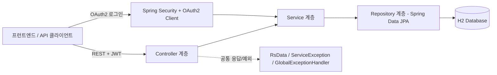

# prgrms-kotlin_conversion

자바 스프링부트로 작성된 게시판/회원 API를, [코프링으로 전환](https://www.slog.gg/p/14128) 강의(전체 67강)를 따라가며 한 강씩 코틀린으로 전환한 학습 저장소입니다. `back/`의 메인 소스와 테스트 소스 전부가 100% 코틀린으로 전환 완료된 상태입니다.

- 자바 원본: [jhs512/p-14184-1](https://github.com/jhs512/p-14184-1)
- 강사의 실제 코틀린 전환 커밋: [jhs512/p-14128-1](https://github.com/jhs512/p-14128-1)

## 기술 스택

**백엔드** (`back/`)
- Kotlin 2.2.20, Spring Boot 4.1.0
- Spring Data JPA + H2
- Spring Security + OAuth2 Client (카카오/구글/네이버 소셜 로그인)
- JJWT(JWT 발급/검증), springdoc-openapi(API 문서)
- JDK 25 툴체인(컴파일 타겟은 JVM 24로 고정 — Kotlin 2.2.20이 아직 JVM_25 타겟 미지원)

**프런트엔드** (`front/`)
- Next.js 16, React 19, TypeScript
- openapi-fetch로 백엔드 API 소비

## 실행 방법

```bash
# 백엔드
cd back
./gradlew bootRun

# 프런트엔드
cd front
pnpm install
pnpm dev
```

## 주요 명령어

```bash
# 백엔드 컴파일만 (커밋 전 필수 확인)
cd back && ./gradlew compileKotlin compileJava compileTestKotlin compileTestJava

# 백엔드 전체 테스트
cd back && ./gradlew test

# 프런트엔드 포맷/타입체크/린트
cd front && pnpm check
```

## 기능 요약

- 회원가입/로그인/로그아웃, JWT 기반 인증(accessToken 쿠키/헤더 + apiKey 재발급), 카카오/구글/네이버 소셜 로그인
- 게시글/댓글 CRUD, 작성자 권한 검사
- 관리자 전용 회원/게시글 조회 API
- 공통 응답 포맷(`RsData<T>`)과 전역 예외 처리(`ServiceException` + `GlobalExceptionHandler`)

## 아키텍처



## 학습 로그

강의별 변환 기록은 [docs/learning-log](docs/learning-log/step-01.md)에서 `step-01.md` ~ `step-67.md`로 확인할 수 있습니다. 진행 방식과 컨벤션은 [docs/learning-log/PROMPT.md](docs/learning-log/PROMPT.md)에 정리되어 있습니다.

다른 프로젝트에도 재사용 가능한 일반화된 Java→Kotlin 전환 규칙은 [docs/conversion-rules/RULES.md](docs/conversion-rules/RULES.md)에 규칙(R-001~)으로 누적 정리되어 있습니다.

## Claude Code 사용자를 위한 안내

이 저장소에서 작업할 때 참고할 규칙은 [CLAUDE.md](CLAUDE.md)에 정리되어 있습니다.
