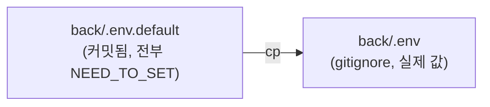

# step-03: .env 파일 복원, 강사의 프로젝트로부터 시작하는 방법

- 강의 링크: https://www.slog.gg/p/14128#3강
- 상태: 완료

## 요구사항 요약

로컬 개발 환경 설정 강의 (소스 코드 타이핑 없음).

- `back/.env.default`: 저장소에 커밋되는 템플릿, 값이 전부 `NEED_TO_SET`
- `back/.env`: `.gitignore`에 등록되어 커밋되지 않는 개인 비밀값 파일
- 생성 방법 1: `.env.default`를 복사해 직접 값 채우기
- 생성 방법 2: 기존에 이미 설정된 프로젝트에서 `.env` 파일 복사
- 필수 값: `CUSTOM__JWT__SECRET_KEY` (JWT 서명용, 없으면 앱 실행 불가)
- 선택 값: 카카오/구글/네이버 OAuth `CLIENT_ID`/`CLIENT_SECRET` (소셜로그인 테스트 시에만 필요)

실제로는 `.env.default`를 복사해 `.env`를 만들고, `CUSTOM__JWT__SECRET_KEY`만 랜덤 64바이트 문자열로 채움. OAuth 값은 `NEED_TO_SET`으로 남겨둠 (필요 시 각 플랫폼에서 직접 발급).

## 아키텍처 다이어그램

## 질문 로그

(없음)
