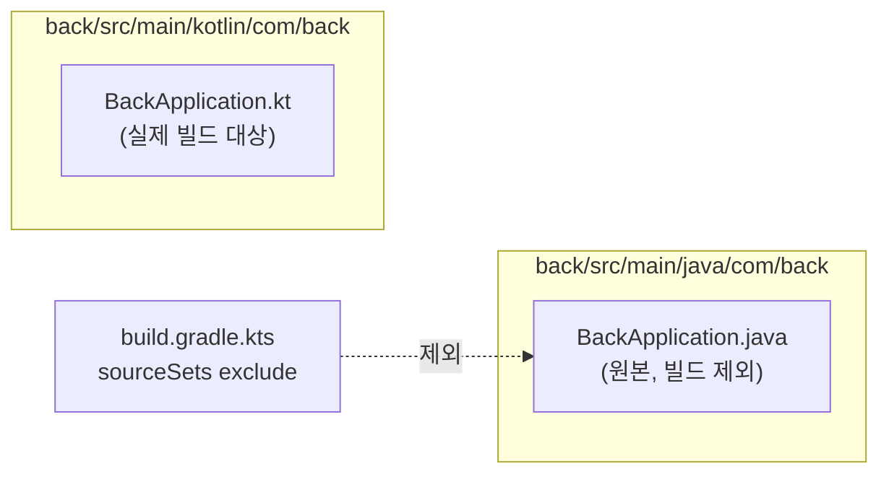

# step-06: BackApplication 변환

- 강의 링크: https://www.slog.gg/p/14128#6강
- 상태: 완료

## 요구사항 요약

첫 실전 코드 변환 강의.

1. `back/build.gradle.kts`에 `kotlin("jvm") version "2.2.20"` 플러그인 추가 (`implementation(kotlin("stdlib-jdk8"))`은 불필요 — `kotlin("jvm")`이 `kotlin-stdlib`을 자동 추가하므로 명시 선언 생략)
2. `back/src/main/java/com/back/BackApplication.java` → `back/src/main/kotlin/com/back/BackApplication.kt` 변환

```kotlin
package com.back

import org.springframework.boot.autoconfigure.SpringBootApplication
import org.springframework.boot.runApplication
import org.springframework.data.jpa.repository.config.EnableJpaAuditing

@SpringBootApplication
@EnableJpaAuditing
class BackApplication

fun main(args: Array<String>) {
    runApplication<BackApplication>(*args)
}
```

주요 변경점: `public class` → 기본 public 생략, static `main` 메서드 → 클래스 밖 top-level `fun main`, `SpringApplication.run(Class, args)` → `runApplication<T>(*args)` (reified 제네릭 + 스프레드 연산자).

### 최종 파일 배치 (자바/코틀린 비교를 위해 둘 다 유지)

- `back/src/main/java/com/back/BackApplication.java` — 원본 자바, **비교용으로 남기되 실제 빌드에서는 제외**
- `back/src/main/kotlin/com/back/BackApplication.kt` — 실제로 빌드되는 코틀린 버전

같은 패키지(`com.back`)에 같은 클래스명(`BackApplication`)이 둘 있으면 중복 클래스 오류가 나므로, `build.gradle.kts`의 `sourceSets { main { java { exclude(...) } } }`로 자바 원본 파일을 컴파일 대상에서만 제외했다. 57강에서 소스 폴더를 java → kotlin으로 정식 이관하기 전까지, 이 프로젝트는 "자바 원본은 참고용으로 계속 남겨두고 코틀린 버전만 빌드되는" 방식으로 진행한다.

### 트러블슈팅: Kotlin/Java JVM 타겟 불일치

- 증상: `compileKotlin` 실행 시 `Inconsistent JVM Target Compatibility Between Java and Kotlin Tasks (compileJava: 25, compileKotlin: 24)` 오류로 빌드 실패
- 원인: Kotlin 2.2.20이 아직 JVM_25 바이트코드 타겟을 지원하지 않아 24로 자동 폴백되는데, `java { toolchain { languageVersion = 25 } }` 설정 때문에 `compileJava`는 25를 타겟으로 잡아서 둘이 어긋남
- 해결: `build.gradle.kts`에 `tasks.withType<JavaCompile> { options.release.set(24) }`와 `kotlin { compilerOptions { jvmTarget.set(JvmTarget.JVM_24) } }`를 추가해 둘 다 24로 통일. JDK 25 툴체인으로 빌드는 하되, 산출되는 바이트코드 타겟만 24로 맞춘 것.

`./gradlew compileKotlin compileJava`, `./gradlew compileTestKotlin compileTestJava` 모두 `BUILD SUCCESSFUL` 확인.

## 아키텍처 다이어그램



## 질문 로그

### 질문1
- **Q.** `kotlin("jvm")`을 왜 별도로 설정해야 하나? 코틀린도 JVM 위에서 도는데 별도 설정이 필요한가?
- **A.** "코틀린이 JVM 위에서 돈다"는 런타임 이야기이고, `kotlin("jvm")` 플러그인은 빌드 시점에 `.kt` 파일을 컴파일할 `kotlinc` 컴파일러를 Gradle에 연결해주는 것. `.java`는 `javac`, `.kt`는 `kotlinc`로 컴파일러 자체가 다름. "jvm"이 붙은 이유는 코틀린 컴파일러가 JS/네이티브/멀티플랫폼 등 다른 타겟도 지원하기 때문.

### 질문2
- **Q.** `static`의 원래 역할이 뭐였지?
- **A.** 인스턴스가 아니라 클래스 자체에 속하는 멤버 — `new` 없이 `클래스명.메서드명()`으로 호출 가능. `main`이 `static`이어야 하는 이유는 JVM이 프로그램을 시작하는 시점엔 아직 객체가 없기 때문. 코틀린엔 `static` 키워드가 없고 top-level 함수가 대신하며, 바이트코드 레벨에서는 여전히 `파일명Kt` 클래스의 static 메서드로 컴파일됨.

### 질문3
- **Q.** 코끼리(Gradle) 아이콘이 안 보여서 코틀린이 인식 안 됨.
- **A.** (개념이 아닌 질문이지만 트러블슈팅으로 분류)
- **트러블슈팅**:
  - 증상: `build.gradle.kts` 수정 후 IntelliJ가 "프로젝트 JDK가 정의되지 않았습니다" 경고를 띄우고 `.kt` 파일이 코틀린으로 인식되지 않음
  - 원인: build 파일만 수정했고 아직 Gradle 재동기화(sync)를 하지 않은 상태
  - 해결: Gradle 패널의 새로고침(⟳) 클릭 또는 "Load Gradle Changes" 알림 클릭 → `File > Project Structure > Project`에서 SDK를 25로 지정

### 질문4
- **Q.** `fun main(args: Array<String>) { runApplication<BackApplication>(*args) }` 구체적으로 설명
- **A.** `runApplication`은 `inline fun <reified T : Any> runApplication(vararg args: String)` 형태의 Spring Boot 코틀린 확장 함수. `reified` 덕분에 타입 소거 없이 런타임에도 `T::class.java`를 알 수 있어 `<BackApplication>`처럼 타입을 직접 넘길 수 있음. `args`는 `Array<String>`인데 `runApplication`은 `vararg`를 받으므로 `*`(스프레드 연산자)로 배열을 풀어서 전달해야 함. 내부적으로 `SpringApplication.run(BackApplication::class.java, *args)`와 동일하게 동작.
