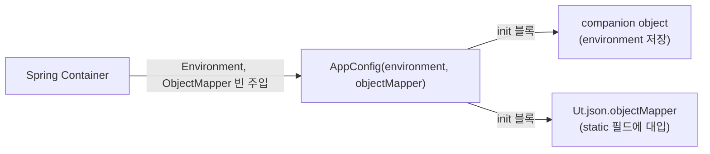

# step-15: AppConfig 변환

- 강의 링크: https://www.slog.gg/p/14128#15강
- 상태: 완료

## 요구사항 요약

`AppConfig.java` 삭제 → `back/src/main/kotlin/com/back/global/app/AppConfig.kt`로 2단계 변환.

**Step 1 (단순 변환)**: `static` 필드/메서드 → `companion object`, static 메서드(`isDev()` 등) → 커스텀 게터가 있는 프로퍼티(`val isDev: Boolean get() = ...`), nullable(`Environment? = null`) + `!!` non-null assertion으로 우선 옮김. 세터 주입(`@Autowired fun setXxx`) + `@PostConstruct`는 그대로 유지.

**Step 2 (코틀린스럽게)**: 세터 주입 + `@PostConstruct` → **생성자 주입 + `init` 블록**. `Environment? = null` + `!!` → `lateinit var environment: Environment`(non-null 확정, 초기화만 미룸).

최종 코드:
```kotlin
@Configuration
class AppConfig(
    environment: Environment,
    objectMapper: ObjectMapper
) {
    init {
        Companion.environment = environment
        Ut.json.objectMapper = objectMapper
    }

    @Bean
    fun passwordEncoder(): PasswordEncoder = BCryptPasswordEncoder()

    companion object {
        private lateinit var environment: Environment

        val isDev: Boolean get() = environment.matchesProfiles("dev")
        val isTest: Boolean get() = !environment.matchesProfiles("test")
        val isProd: Boolean get() = environment.matchesProfiles("prod")
        val isNotProd: Boolean get() = !isProd
    }
}
```

### 핵심 개념

- `companion object`: 코틀린엔 `static`이 없어서, 클래스에 딱 하나 자동으로 딸려오는 싱글턴 객체(`companion object`)에 공유 멤버를 넣는다.
- `val isDev: Boolean get() = ...`: 값을 계산해서 반환하기만 하는 static 메서드는 커스텀 게터 프로퍼티로 표현하는 게 코틀린 관례. 호출부는 괄호 없이 `AppConfig.isDev`.
- `Companion.environment = environment`: 생성자 파라미터명과 companion 멤버명이 같아서, 파라미터가 이름을 가리므로 `Companion.` 명시 필요.
- `lateinit var`: "지금 초기화 안 해도 되지만 쓰기 전엔 반드시 채워 넣겠다"는 약속. `?`/`!!` 없이 non-null 타입 그대로 쓸 수 있게 해줌. 값이 없는 채로 접근하면 `NullPointerException`이 아니라 `UninitializedPropertyAccessException` 발생.
- 세터 주입+`@PostConstruct` → 생성자 주입+`init`: 생성자 파라미터로 의존성을 즉시 받으면 "값이 없는 불완전한 중간 상태"가 생기지 않아 `lateinit`이 안전해지고, 별도 생명주기 어노테이션(`@PostConstruct`)이 필요 없어짐.

`AppConfig`를 참조하는 다른 Java 파일이 현재 프로젝트에 없어서(grep 확인) 16강의 `@JvmStatic` 이슈는 아직 실제로 발현되지 않음 — 다음 강에서 그 문제와 해결법을 미리 설명.

`./gradlew compileKotlin compileJava compileTestKotlin compileTestJava` `BUILD SUCCESSFUL` 확인.

## 아키텍처 다이어그램



## 질문 로그

### 질문1
- **Q.** 변경 부분(companion object, lateinit, 생성자 주입 등)에 대해 더 구체적으로 설명해줘
- **A.** static↔companion object, isDev() 메서드↔프로퍼티 게터, `Environment?`+`!!`↔`lateinit`, 세터+`@PostConstruct`↔생성자+`init`을 각각 예시 값과 실행 순서로 트레이스해서 설명. (본문 참고)

### 질문2
- **Q.** `Ut.json.objectMapper = objectMapper` 이 부분에 대해서
- **A.** `Ut`는 Spring이 관리하지 않는 정적 유틸 클래스라 DI를 직접 못 받음. Spring 빈인 `AppConfig`가 생성자로 받은 `ObjectMapper`를 `Ut.json.objectMapper`(static 필드)에 수동으로 대입해, Spring이 설정한 것과 동일한 인스턴스를 앱 전역의 정적 유틸에서도 쓸 수 있게 연결하는 다리 역할.

### 질문3
- **Q.** `Ut.json.toString()`이 하는 역할이 뭔지
- **A.** `ObjectMapper.writeValueAsString(object)`를 감싼 안전한 래퍼. 직접 호출 시 체크 예외(`JsonProcessingException`)를 던지는데, 이 유틸은 try-catch를 한 곳에 모아 실패 시 대체값(기본 `null`)을 반환해 호출부에서 예외 처리 부담을 없앰. 실제 사용처(`CustomAuthenticationFilter`)는 Spring MVC 정상 흐름 밖(서블릿 필터)에서 응답 객체를 수동으로 JSON 직렬화해 HTTP 응답에 쓸 때 사용.
