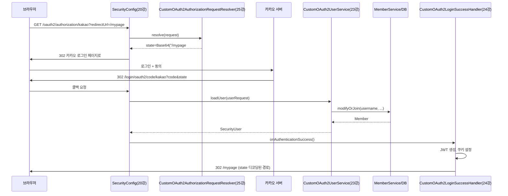

# step-25: CustomOAuth2AuthorizationRequestResolver 변환

- 강의 링크: https://www.slog.gg/p/14128#25강
- 상태: 완료

## 요구사항 요약

`CustomOAuth2AuthorizationRequestResolver.java` 삭제 → `back/src/main/kotlin/com/back/global/security/CustomOAuth2AuthorizationRequestResolver.kt` 변환.

### 새로운 개념

- **메서드 → 프로퍼티(한 번만 생성)**: 자바의 `createDefaultResolver()`(매 요청마다 새로 생성)를 `private val delegate = DefaultOAuth2AuthorizationRequestResolver(...)`(생성자에서 한 번만 생성 후 재사용)로 바꿈 — 불필요한 객체 생성 제거.
- **`.orEmpty().ifBlank { "/" }`**: `request.getParameter(...)`(nullable)을 `.orEmpty()`(null→빈 문자열)와 `.ifBlank { }`(비어있으면 기본값)으로 체이닝. 자바 원본은 null만 체크했는데 빈 문자열/공백까지 처리하도록 더 안전해짐.

### 이 강 전체 로직 학습 중 정리한 것

- 소셜로그인(카카오) 전체 흐름을 20~25강 코드를 순서대로 따라가며 트레이스: 로그인 클릭 → (25강)state에 redirectUrl 암호화 → 카카오 인증 → (23강)회원 조회/가입+SecurityUser 생성 → (24강)JWT 발급+쿠키+state 복호화 리다이렉트.
- Mermaid 시퀀스 다이어그램 + SVG 위젯(visualize 도구)으로 시각화.

## 트러블슈팅

- **증상**: `override fun resolve(request: HttpServletRequest, clientRegistrationId: String?)`로 작성 시 컴파일 에러 — "overrides nothing", "타입 불일치(String? vs String)"
- **원인**: 인터페이스(`OAuth2AuthorizationRequestResolver`)의 자바 메서드 시그니처가 실제로는 `clientRegistrationId: String`(non-null)으로 해석됨. 자바 인터페이스를 오버라이드할 때는 실제 해석된 nullable 여부와 정확히 일치해야 함.
- **해결**: `clientRegistrationId: String?` → `clientRegistrationId: String`으로 수정.

`./gradlew compileKotlin compileJava compileTestKotlin compileTestJava` `BUILD SUCCESSFUL` 확인.

## 아키텍처 다이어그램

## 질문 로그

### 질문1
- **Q.** "리졸버(Resolver)"가 뭔지
- **A.** "해결하다/확정하다"는 뜻의 프로그래밍 용어. `OAuth2AuthorizationRequestResolver`는 애매한 HTTP 요청("카카오 로그인 시작해줘")을 완전히 구체화된 `OAuth2AuthorizationRequest`(카카오 인증 서버 주소, client_id, state 등이 다 채워진 객체)로 "해결"해주는 역할. `delegate`는 표준적인 부분을 위임(맡기는) 대상.
